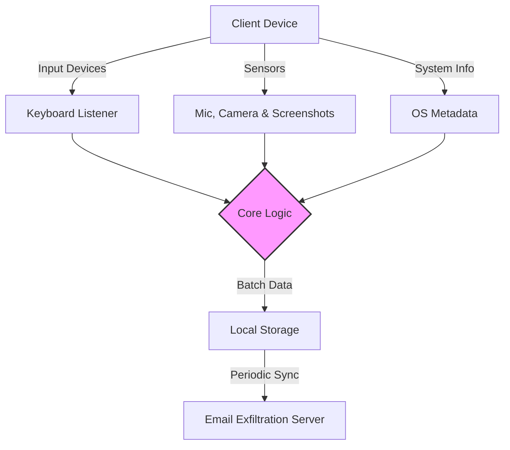

# spyware-demonstration

This repository is built with strict enterprise engineering standards, focusing on resilient architecture, graceful error handling, and robust continuous integration.

## 🏗️ System Architecture



## 🚀 Setup Instructions

We use Docker to ensure a reproducible environment. Follow these step-by-step instructions:

1. **Ensure Docker is installed** and running on your system.
2. **Build and start the container** in detached mode using Docker Compose:

```bash
docker-compose up --build -d
```

3. **Verify running services**:

```bash
docker-compose ps
```

4. **Stop the services gracefully** when done:

```bash
docker-compose down
```

## 📂 Structure

Following standard design patterns for a predictable layout:
- `src/` - Core application logic and entry points.
- `tests/` - Unit tests for core functions.
- `.github/workflows/` - CI pipeline configuration.

## 📦 Dependency Rationale

- **pynput (1.7.6):** Provides a robust, cross-platform way to listen to and control the keyboard securely.
- **psutil (5.9.6):** Efficient retrieval of system information, required for detailed footprinting.
- **opencv-python & sounddevice & scipy:** Essential libraries for reliable camera and microphone stream capture without heavy OS-specific API calls.
- **pyscreenshot:** Fallback screenshot mechanism ensuring broad compatibility.
- **pywin32:** Necessary for accessing the Windows clipboard reliably.

---
## Security Warning
This tool is for authorized monitoring only. Unauthorized use may be illegal.
